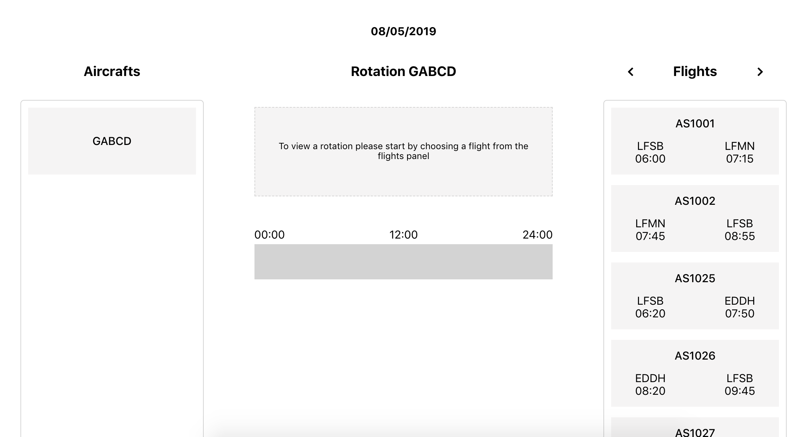
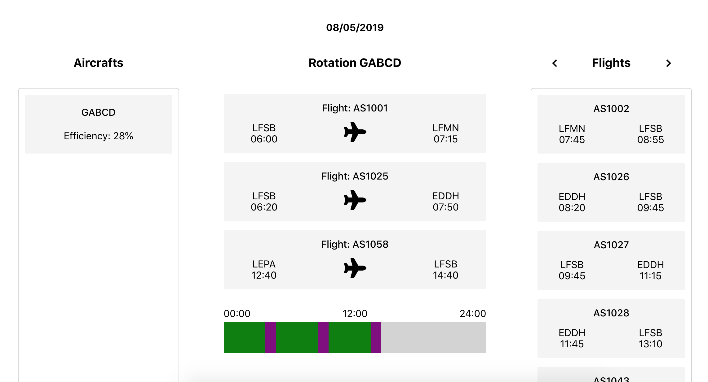

### Key points:
- Focus on Clean, Modular, Dry code
- Commented code to try and explain some complexity
- Create React App used for speed and familiarity
- API pagination using Hooks
- Loading, error and component render states give visible feedback for async calls
- Styled closely to the spec, with additions like hover states and other minor UI bits.

### File structure:
- Containers, Components -> inc scss files (and ideally tests w/ more time)
- Styling uses SASS
- Public - Nothing special here, but you might recognise the favicon ;)

### Global styles:
- Reusable variables and mixins - inside `variables.scss`
- Nesting for readability.
- Note: Would consider something like a BEM type approach to naming for consistency if this were a larger app.

### With more time:
- Timeline that adheres to exact 24hr timings
- HOC / Middleware for API + reusable loading state

### Testing:
- No unit testing purely from a time perspective.
- Did include enzyme and a `setupTests.js` file.

### State management:
I deliberately didn't use any additional state management such as Redux, because I'm used to doing so and for an app of this scale I wanted to challenge myself and take a more "bare bones" type approach. There are certainly some tradeoffs in doing so.

### Additional Notes:
Redux definitely would have been helpful to clean the containers a little bit and to make use of **selectors** for simple state comparisons when adding and removing flights from the arrays within the flights and rotation components.

## Screenshots:

### 1. No flights selected:

### 2. Some flights selected:

## To run:

### `npm i`

### `npm start`
